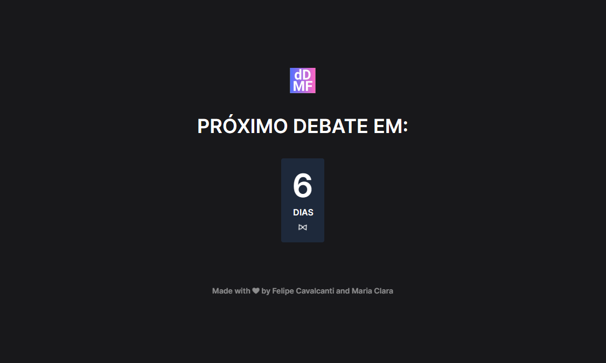

# dDMF - Dia do Debate Maria e Felipe.

 Eu e minha namorada gostados de debater, e eu decidi fazer um app que permite pegar notícias recentes usando a API do Google Gemini, e com base nessa notícia gerar um título de um debate para que possamos discutir toda sexta-feira.

## Recursos Principais
- O App faz uma requisição à API do Gemini toda sexta-feira e gera um título de debate.

## Como Usar
- Você pode acessar o projeto aqui:
  (https://feapolina.github.io/gdebate-app/)

## Executar Localmente

Clone o projeto

```bash
  git clone https://github.com/feapolina/gdebate-app.git
```

Vá para o diretorio do projeto

```bash
  Execute o arquivo index.html
```


## Tecnologias Utilizadas

### Back end:
- TypeScript.

### Front end:
- ReactJS e Tailwindcss.


## Autores:

- [@feapolina](https://github.com/feapolina)

## Feedback

Se você tiver algum feedback, entre em contato pelo email: fe.cavalcanti2016@gmail.com
